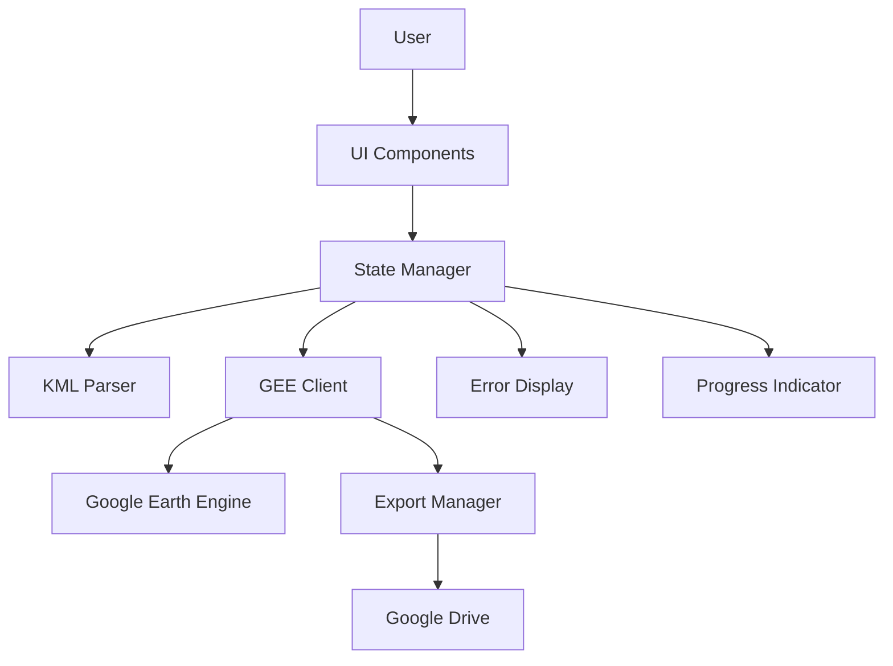

# Satellite Data Acquisition Web Interface

A browser-based interface for acquiring satellite data from Google Earth Engine, specifically designed for mining area analysis using Sentinel-1 and Sentinel-2 imagery. This application provides a simple, government-style interface that enables users to upload KML files, select date ranges, fetch satellite imagery, and export GeoTIFF files to Google Drive.

## Features

- 🛰️ **Dual Satellite Support**: Choose between Sentinel-1 SAR and Sentinel-2 optical imagery
- 📍 **KML File Upload**: Upload polygon geometries defining areas of interest
- 📅 **Temporal Analysis**: Select Pre and Post imagery dates for change detection
- ☁️ **Cloud Filtering**: Automatic filtering for images with <20% cloud cover
- 📦 **Batch Processing**: Process multiple polygons from a single KML file
- 💾 **GeoTIFF Export**: Export imagery directly to Google Drive in GeoTIFF format
- 🎨 **Clean UI**: Government-style interface with straightforward navigation
- ✅ **Comprehensive Testing**: Property-based and unit tests for reliability

## System Requirements

### Browser Compatibility

The application is tested and supported on the following browsers:

- **Chrome** 90 or later
- **Firefox** 88 or later
- **Safari** 14 or later
- **Microsoft Edge** 90 or later

**Note**: The application requires JavaScript to be enabled and uses modern ES6+ features. Older browsers are not supported.

### Prerequisites

- **Google Earth Engine Account**: You must have a Google account with Earth Engine API access enabled
  - Sign up at: https://earthengine.google.com/
  - Approval typically takes 1-2 business days
- **Google Drive**: Required for exporting GeoTIFF files
- **Internet Connection**: Required for accessing Google Earth Engine API

### Development Requirements

For running tests and development:

- **Node.js** 16 or later
- **npm** 7 or later

## Setup Instructions

### 1. Google Earth Engine Authentication

**IMPORTANT**: Before using the application, you must configure Google Earth Engine OAuth2 credentials. See the detailed setup guide: **[GEE_AUTHENTICATION_SETUP.md](GEE_AUTHENTICATION_SETUP.md)**

**Quick Setup Summary**:

1. **Get OAuth 2.0 Client ID**:
   - Go to [Google Cloud Console](https://console.cloud.google.com/)
   - Select the `mining-detection` project
   - Navigate to **APIs & Services** > **Credentials**
   - Create OAuth 2.0 Client ID for Web application
   - Add `http://localhost:8000` to authorized JavaScript origins
   - Copy the Client ID

2. **Configure the Application**:
   - Open `src/utils/config.js`
   - Find the `gee` section
   - Replace `clientId: null` with your Client ID:
   ```javascript
   gee: {
     project: 'mining-detection',
     clientId: 'YOUR_CLIENT_ID_HERE.apps.googleusercontent.com',
     // ... rest of config
   }
   ```

3. **Test Authentication**:
   - Start the local server (see step 2 below)
   - Open the application in your browser
   - You should NOT see "Demo Mode" warning
   - When you click "Fetch", you'll be prompted to sign in with Google

**For detailed instructions, troubleshooting, and security notes, see [GEE_AUTHENTICATION_SETUP.md](GEE_AUTHENTICATION_SETUP.md)**

### 2. Running the Application

The application runs entirely in the browser with no server-side components.

**Option 1: Direct File Access** (Simplest)
```bash
# Simply open index.html in your browser
# Note: Some browsers may restrict certain features when using file:// protocol
```

**Option 2: Local HTTP Server** (Recommended)

Using Python:
```bash
python -m http.server 8000
# Then open http://localhost:8000 in your browser
```

Using Node.js:
```bash
npx http-server -p 8000
# Then open http://localhost:8000 in your browser
```

Using VS Code:
```bash
# Install "Live Server" extension
# Right-click index.html and select "Open with Live Server"
```

### 3. Development Setup (Optional)

For developers who want to run tests or modify the code:

```bash
# Clone or download the repository
cd satellite-data-web-interface

# Install dependencies
npm install

# Run all tests
npm test

# Run tests in watch mode (auto-rerun on file changes)
npm test:watch

# Generate code coverage report
npm test:coverage
```

## Usage Instructions

### Step-by-Step Workflow

#### 1. Select Satellite Type

- Use the toggle switch in the top-left to choose between:
  - **SENTINEL-1**: Synthetic Aperture Radar (SAR) imagery
    - Bands: VV, VH
    - Works in all weather conditions
    - Good for detecting structural changes
  - **SENTINEL-2**: Optical multispectral imagery (default)
    - Bands: B2 (Blue), B3 (Green), B4 (Red), B8 (NIR), B11 (SWIR1), B12 (SWIR2)
    - 10-meter resolution
    - Best for visual analysis and vegetation monitoring

#### 2. Select Dates

- Click the **"Select Date"** button in the **Pre** window
  - Choose the date for baseline imagery (earlier date)
- Click the **"Select Date"** button in the **Post** window
  - Choose the date for comparison imagery (later date)

**Tips**:
- Select dates at least 1-2 months apart for meaningful change detection
- Avoid very recent dates (last 1-2 weeks) as imagery may not be available yet
- Consider seasonal variations when selecting dates

#### 3. Upload KML File

- Click **"Select AOI (in .kml)"** button
- Choose a KML file from your computer
- Wait for the file to be parsed
- Status message will show the number of polygons loaded

**Example**: "Successfully loaded 3 polygon(s) from mining_areas.kml"

#### 4. Fetch Satellite Imagery

- Click the **"Fetch"** button
- If not authenticated, you'll be redirected to Google sign-in
- Progress indicator shows fetching status for each polygon
- Wait for the operation to complete (may take 30-60 seconds per polygon)

**What happens during fetch**:
- Queries Google Earth Engine for imagery matching your parameters
- Filters images by date range and cloud cover (<20%)
- Creates a median composite to reduce cloud artifacts
- Clips imagery to your polygon boundaries

#### 5. Download GeoTIFF Files

- Click **"Download (in .tiff)"** button
- Export tasks are created for each polygon
- Files are exported to your Google Drive
- Check the folder: `MINE_SIH2025_GEE_Data`

**Note**: Export processing happens on Google's servers and may take several minutes. You can close the browser and check Google Drive later.

### Understanding the Interface

```
┌─────────────────────────────────────────────────────────┐
│  Satellite Data Acquisition Interface                   │
├─────────────────────────────────────────────────────────┤
│                                                          │
│  [SENTINEL-1 | SENTINEL-2]  ← Satellite Selector        │
│                                                          │
│  ┌──────────────────┐  ┌──────────────────┐            │
│  │      Pre         │  │      Post        │            │
│  │  [Select Date]   │  │  [Select Date]   │            │
│  │  2023-01-15      │  │  2023-06-15      │            │
│  └──────────────────┘  └──────────────────┘            │
│                                                          │
│  [Select AOI (.kml)] [Fetch] [Download (.tiff)]        │
│       Blue            Green      Yellow                 │
│                                                          │
│  Status: Ready to fetch imagery for 3 polygon(s)        │
└─────────────────────────────────────────────────────────┘
```

## KML File Format Requirements

### Supported Geometry Types

The application accepts KML files with the following geometry types:

- **Polygon**: Single polygon with one or more rings
- **MultiPolygon**: Multiple polygons grouped together

**Unsupported types** (will be skipped with a warning):
- Point
- LineString
- MultiPoint
- MultiLineString

### KML File Structure

Your KML file should follow this structure:

```xml
<?xml version="1.0" encoding="UTF-8"?>
<kml xmlns="http://www.opengis.net/kml/2.2">
  <Document>
    <Placemark>
      <name>Mining Area 1</name>
      <Polygon>
        <outerBoundaryIs>
          <LinearRing>
            <coordinates>
              77.5,12.9,0
              77.6,12.9,0
              77.6,13.0,0
              77.5,13.0,0
              77.5,12.9,0
            </coordinates>
          </LinearRing>
        </outerBoundaryIs>
      </Polygon>
    </Placemark>
    <Placemark>
      <name>Mining Area 2</name>
      <Polygon>
        <!-- Additional polygon -->
      </Polygon>
    </Placemark>
  </Document>
</kml>
```

### Creating KML Files

**Option 1: Google Earth**
1. Open Google Earth (desktop or web)
2. Use the polygon tool to draw your areas of interest
3. Right-click on the polygon and select "Save Place As..."
4. Choose KML format and save

**Option 2: QGIS**
1. Create or load polygon layers
2. Right-click layer → Export → Save Features As...
3. Select "KML" as format
4. Save the file

**Option 3: Python (using simplekml)**
```python
import simplekml

kml = simplekml.Kml()
pol = kml.newpolygon(name="Mining Area 1")
pol.outerboundaryis = [(77.5, 12.9), (77.6, 12.9), (77.6, 13.0), (77.5, 13.0), (77.5, 12.9)]
kml.save("mining_areas.kml")
```

### Coordinate Format

- **Coordinate System**: WGS84 (EPSG:4326)
- **Format**: longitude,latitude,altitude (altitude is optional and will be removed)
- **Precision**: At least 6 decimal places recommended (~0.1 meter accuracy)
- **Order**: Coordinates must form a closed ring (first point = last point)

### File Size Limits

- **Maximum file size**: 10 MB
- **Recommended**: Keep KML files under 1 MB for best performance
- **Polygon complexity**: No hard limit, but simpler polygons process faster

## Troubleshooting Common Errors

### Authentication Errors

**Error**: "Authentication failed. Please sign in to Google Earth Engine."

**Solutions**:
- Ensure you have a Google Earth Engine account (sign up at https://earthengine.google.com/)
- Check that your account has been approved (check your email)
- Disable popup blockers for the application
- Clear browser cache and cookies
- Try a different browser
- Safari users: Check Settings → Privacy → Cookies and Website Data → Allow from websites you visit

### KML Parsing Errors

**Error**: "Failed to parse KML file. Please ensure the file is valid."

**Solutions**:
- Verify the file has a `.kml` extension (not `.kmz`)
- Open the KML file in a text editor to check for XML syntax errors
- Ensure the file contains at least one Polygon or MultiPolygon
- Validate your KML using an online validator
- Re-export the KML from Google Earth or QGIS
- Check that coordinates are in the correct format (longitude,latitude)

**Error**: "Unsupported geometry type: Point"

**Solution**: The application only supports Polygon and MultiPolygon geometries. Convert points or lines to polygons using a GIS tool.

### Fetch Errors

**Error**: "Failed to fetch satellite imagery. Please check your selections."

**Solutions**:
- Verify all required fields are filled (satellite, dates, AOI)
- Check your internet connection
- Ensure the date range is valid (Pre date before Post date)
- Try a different date range (imagery may not be available for selected dates)

**Error**: "No images available for the selected parameters."

**Solutions**:
- Try a wider date range (e.g., ±1 month)
- Check if the area is covered by the selected satellite
- Very recent dates may not have processed imagery yet (try dates at least 1-2 weeks old)
- Some remote areas may have limited coverage

### Export Errors

**Error**: "Failed to export GeoTIFF. Please try again."

**Solutions**:
- Check your Google Drive storage space
- Verify you're signed in to Google Drive
- Try exporting fewer polygons at once
- Check Google Earth Engine task manager: https://code.earthengine.google.com/tasks
- Wait a few minutes and check if tasks are processing

**Error**: "Export task failed" (in Google Drive)

**Solutions**:
- Polygon may be too large (try splitting into smaller areas)
- Increase the maxPixels parameter in the code (default: 1e13)
- Check Earth Engine quota limits for your account

### Browser-Specific Issues

**Chrome/Edge**:
- Clear cache: Settings → Privacy → Clear browsing data
- Disable extensions that might interfere with JavaScript

**Firefox**:
- Enhanced Tracking Protection may block GEE API
- Try disabling for this site: Shield icon in address bar → Turn off protection

**Safari**:
- Third-party cookies must be enabled
- Settings → Privacy → Uncheck "Prevent cross-site tracking" (for this site)

### Performance Issues

**Slow loading or freezing**:
- Reduce the number of polygons in your KML file
- Simplify complex polygon geometries
- Close other browser tabs to free up memory
- Try a different browser
- Check your internet connection speed

## Project Structure and Architecture

### Directory Structure

```
satellite-data-web-interface/
├── index.html                      # Main HTML entry point
├── package.json                    # Node.js dependencies and scripts
├── .babelrc                        # Babel configuration for ES6 modules
├── README.md                       # This file
├── MANUAL_TESTING_GUIDE.md         # Browser testing procedures
├── BROWSER_TEST_CHECKLIST.md       # Quick testing checklist
├── SETUP_COMPLETE.md               # Setup verification guide
│
├── src/                            # Source code
│   ├── main.js                     # Application entry point and workflow orchestration
│   │
│   ├── components/                 # UI and business logic components
│   │   ├── actionButtons.js        # AOI, Fetch, Download button controls
│   │   ├── datePicker.js           # Pre/Post date selection component
│   │   ├── errorDisplay.js         # Error modal display component
│   │   ├── exportManager.js        # GeoTIFF export management
│   │   ├── geeClient.js            # Google Earth Engine API client
│   │   ├── kmlParser.js            # KML file parsing and validation
│   │   ├── progressIndicator.js    # Progress bar and status display
│   │   ├── satelliteSelector.js    # Satellite type toggle switch
│   │   └── stateManager.js         # Centralized application state
│   │
│   ├── models/                     # Data models
│   │   ├── polygon.js              # Polygon geometry model
│   │   └── satelliteImage.js       # Satellite imagery metadata model
│   │
│   ├── utils/                      # Utility functions
│   │   ├── config.js               # Configuration constants
│   │   ├── coordinateCleaner.js    # Coordinate transformation utilities
│   │   └── errors.js               # Error handling and types
│   │
│   └── styles/
│       └── main.css                # Government-style CSS theme
│
├── tests/                          # Test suite
│   ├── setup.js                    # Jest and fast-check configuration
│   ├── *.test.js                   # Unit tests
│   └── *.property.test.js          # Property-based tests
│
└── coverage/                       # Code coverage reports (generated)
    └── lcov-report/index.html      # HTML coverage report
```

### Architecture Overview

The application follows a **component-based architecture** with three main layers:

#### 1. Presentation Layer (UI Components)
- **Satellite Selector**: Toggle between Sentinel-1 and Sentinel-2
- **Date Pickers**: Select Pre and Post imagery dates
- **Action Buttons**: Trigger KML upload, fetch, and download operations
- **Error Display**: Show user-friendly error messages
- **Progress Indicator**: Display operation progress

#### 2. Business Logic Layer
- **State Manager**: Centralized state management and validation
- **KML Parser**: Parse and validate KML files
- **Coordinate Cleaner**: Transform coordinates for GEE compatibility

#### 3. Integration Layer
- **GEE Client**: Interface with Google Earth Engine API
- **Export Manager**: Manage GeoTIFF export operations

### Data Flow

```
User Action → UI Component → State Manager → Business Logic → GEE API
                                    ↓
                            State Change Notification
                                    ↓
                            UI Update (via subscription)
```

### Key Design Decisions

1. **Vanilla JavaScript**: No frameworks for simplicity and minimal dependencies
2. **Client-Side Only**: No server required, runs entirely in the browser
3. **ES6 Modules**: Modern JavaScript with import/export syntax
4. **Event-Driven**: Components communicate via callbacks and subscriptions
5. **Immutable Config**: Configuration is frozen to prevent accidental modifications
6. **Error Boundaries**: Comprehensive error handling at each layer

### Component Interactions



### State Management

The `StateManager` component maintains the application state:

```javascript
{
  satellite: 'SENTINEL-2',           // Selected satellite type
  preDate: Date,                     // Pre imagery date
  postDate: Date,                    // Post imagery date
  polygons: Array<Polygon>,          // Loaded AOI polygons
  imagery: Map<string, ee.Image>,    // Fetched imagery by polygon name
  status: 'idle' | 'fetching' | 'ready' | 'downloading' | 'error',
  errorMessage: string | null
}
```

### Testing Strategy

The project uses a **dual testing approach**:

#### Property-Based Tests (fast-check)
- Test universal properties across all valid inputs
- 100+ iterations per property
- Focus on parsing, transformation, and validation logic

**Example Properties**:
- KML parsing completeness: N polygons in → N polygons out
- Coordinate cleaning: 3D coords → 2D coords with preserved precision
- Filename uniqueness: Different inputs → unique filenames

#### Unit Tests (Jest)
- Test specific examples and edge cases
- Focus on UI components and integration points
- Mock external dependencies (GEE API)

**Coverage Goals**:
- Property tests: 100% of parsing/transformation logic
- Unit tests: 80%+ of business logic
- Integration tests: All critical workflows

### Configuration

All configuration is centralized in `src/utils/config.js`:

```javascript
CONFIG = {
  satellites: {
    'SENTINEL-1': { collection, bands, scale },
    'SENTINEL-2': { collection, bands, scale }
  },
  cloudCoverMax: 20,
  export: { folder, crs, maxPixels, fileFormat },
  ui: { colors, buttons },
  coordinates: { precision, ranges },
  files: { allowedExtensions, maxFileSize }
}
```

## Development Guide

### Running Tests

```bash
# Run all tests once
npm test

# Run tests in watch mode (auto-rerun on changes)
npm test:watch

# Generate coverage report
npm test:coverage

# View coverage report
open coverage/lcov-report/index.html
```

### Code Style

- **ES6+**: Use modern JavaScript features (arrow functions, destructuring, async/await)
- **Modules**: Use import/export for code organization
- **Comments**: Document complex logic and public APIs
- **Error Handling**: Use try/catch and AppError class
- **Validation**: Validate inputs at component boundaries

### Adding New Features

1. **Update Requirements**: Document new requirements in `.kiro/specs/satellite-data-web-interface/requirements.md`
2. **Update Design**: Add component interfaces and properties to `design.md`
3. **Write Tests First**: Create property tests and unit tests
4. **Implement Feature**: Write the code to pass the tests
5. **Update Documentation**: Update this README and other docs

### Debugging Tips

**Enable Verbose Logging**:
```javascript
// In browser console
localStorage.setItem('debug', 'true');
```

**Check GEE API Status**:
```javascript
// In browser console
console.log(ee.data.getAuthToken());
```

**Inspect State**:
```javascript
// In browser console (after app loads)
window.stateManager.getState();
```

## API Reference

### Google Earth Engine Collections

**Sentinel-2 Surface Reflectance Harmonized**:
- Collection ID: `COPERNICUS/S2_SR_HARMONIZED`
- Bands: B2 (Blue), B3 (Green), B4 (Red), B8 (NIR), B11 (SWIR1), B12 (SWIR2)
- Resolution: 10m (B2, B3, B4, B8), 20m (B11, B12)
- Temporal Coverage: 2017-03-28 to present

**Sentinel-1 SAR Ground Range Detected**:
- Collection ID: `COPERNICUS/S1_GRD`
- Bands: VV, VH
- Resolution: 10m
- Temporal Coverage: 2014-10-03 to present

### Export Parameters

- **Scale**: 10 meters per pixel
- **CRS**: EPSG:4326 (WGS84)
- **Max Pixels**: 1e13 (10 trillion pixels)
- **Format**: GeoTIFF (Float32)
- **Destination**: Google Drive folder `MINE_SIH2025_GEE_Data`

## Contributing

Contributions are welcome! Please follow these guidelines:

1. Fork the repository
2. Create a feature branch (`git checkout -b feature/amazing-feature`)
3. Write tests for your changes
4. Ensure all tests pass (`npm test`)
5. Commit your changes (`git commit -m 'Add amazing feature'`)
6. Push to the branch (`git push origin feature/amazing-feature`)
7. Open a Pull Request

## License

MIT License - see LICENSE file for details

## Acknowledgments

- **Google Earth Engine**: For providing satellite imagery and processing infrastructure
- **Sentinel Missions**: ESA's Copernicus Programme for open satellite data
- **fast-check**: Property-based testing library
- **Jest**: JavaScript testing framework

## Support

For issues, questions, or contributions:

- **Documentation**: See `MANUAL_TESTING_GUIDE.md` for detailed testing procedures
- **Issues**: Check existing issues or create a new one
- **Google Earth Engine**: https://developers.google.com/earth-engine
- **Sentinel Data**: https://sentinel.esa.int/

## Version History

- **v1.0.0** (2024): Initial release
  - Sentinel-1 and Sentinel-2 support
  - KML file upload and parsing
  - Google Earth Engine integration
  - GeoTIFF export to Google Drive
  - Comprehensive test suite
  - Browser compatibility (Chrome, Firefox, Safari, Edge)

---

**Built with ❤️ for mining area analysis and environmental monitoring**
